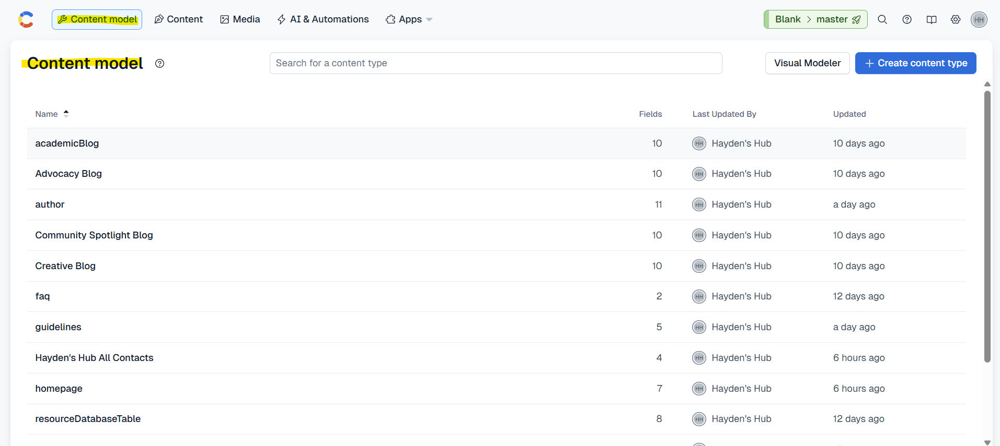

In Contentful, a **Content Model** defines **the structure of your content**.  
Think of it like a **template** that tells the website:

- What fields exist (e.g., Name, Bio, Image for a Team Member)
- What type of data each field holds (text, number, image, link)
- How content entries will appear on the website

---

## Viewing Content Models

1. **Log in to Contentful** → [https://app.contentful.com/](https://app.contentful.com/)  
2. Select the **Hayden’s Hub** space.  
3. In the **top navigation**, click the first option: **Content model**.  

You will see a **list of models** like:

- **homepage** – Hero text, About Us sections  
- **team** – Name, Title, Bio, LinkedIn, Headshot  
- **faq** – Frequently asked Question and Answer  
- **author** – Author Name, Bio, Reflection on Writing, Contact..  
- **guidelines** – Article content guidelines  
- and many more...

---

## Important Notes for Admins

- **You do NOT need to create or modify Content Models.**  
  These are **set up by developers** to define how the website reads and displays content.
  
- **Admins only work with Entries**, which are the actual pieces of content that fit into these models. We will look into that in next Section. 

#### Never delete or change a Content Model, as it can break the website.

---

Next, we will learn how to **add, edit, and delete entries** using these models safely.
