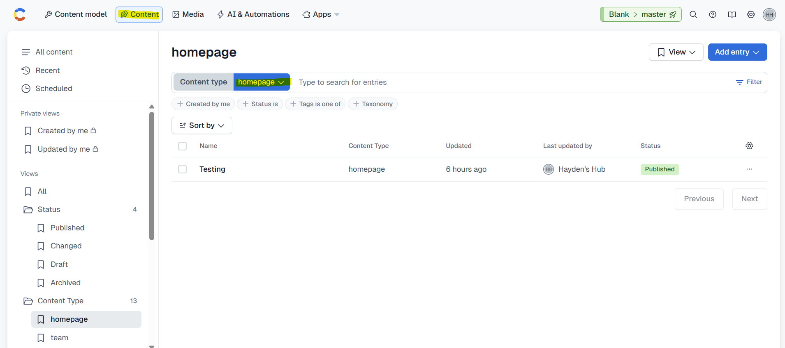
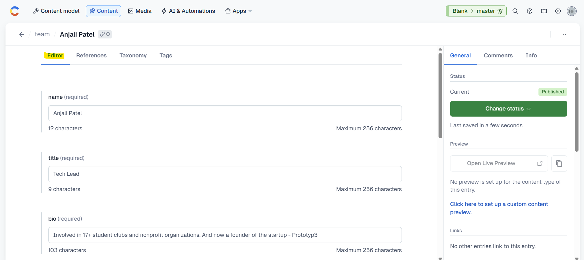
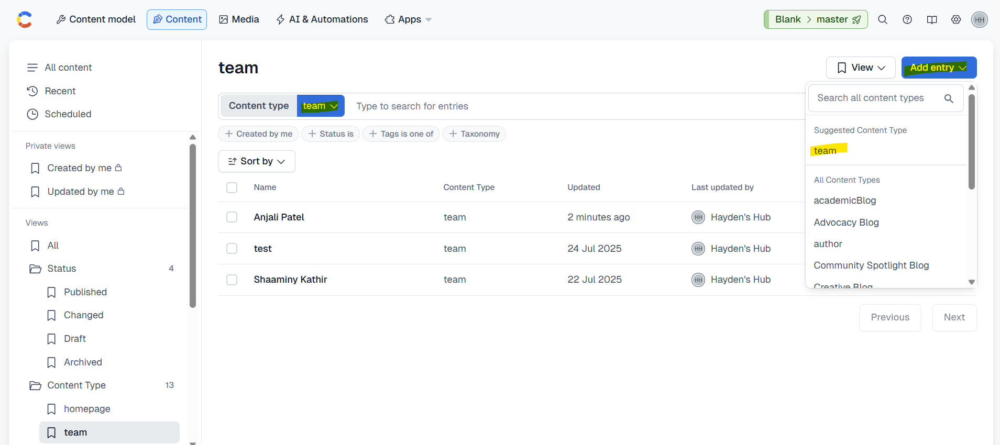

Once the **Content Models** define the structure, the **actual content** that appears on the website is stored in **Entries**.  

Think of it like this:

- **Content Model** = Template (like “Team Member”)
- **Content Entry** = Actual content (like “Jane Doe – Tech Lead”)

---

## Where to View Entries

1. Log in to **[Contentful](https://app.contentful.com/)**  
2. Select the **Hayden’s Hub** space. *(this should be selected by Default)* 
3. Click on the **Content** tab in the top menu.  
4. Use the **content type filter** (dropdown) to see entries for a specific model, like:

    - homepage  
    - team
    - faq 
    - author  
    - guidelines and many more...

---

## How to Add or Edit an Entry

You **only need one workflow** for all content models:

1. Open **Content** in Contentful Dashboard.
2. **Filter by Content Type** (e.g., `homepage`, `team`, `faq`).
3. Choose one:
   - **Edit Existing Entry** → Click the entry → Update fields → **Publish**.
   - **Add New Entry** → Click **Add Entry** → Choose the Content Type → Fill required fields → **Publish**.

**Publishing Notes:**

- **Published:** Visible on the website.
- **Draft / Changed:** Saved but **not live** until published.
- **Unpublished:** Hidden from the site, but still stored.

## How to Add Images

1. Click on the **Add media** button.
2. You will see **two options**:
   - **Add existing media**  
   - **Add new media**
3. **If the image already exists in Contentful**:
   - Choose **Add existing media**.
   - Browse through the list of available images.
   - Select the image you want.
   - **Done!** The image is now linked to your entry.
4. **If the image is new**:
   - Click **Add new media**.
   - Fill in all required details (like title/description for accessibility).
   - Use the file selector to **upload the image**.
   - Once uploaded, you’ll see **editing tools** (including **Crop Image**).
   - Crop the image if needed.
   - **Publish** the image to make it usable on the website.

---

## How to Delete an Existing Entry

1. Open **Contentful** and **click on the entry** to open the **Editor Dashboard**.
2. On the **top-right corner**, locate the **three dots (⋯)** above the **Publish/Change Status** button.
3. Click the **three dots menu**.
4. Select **Delete**.
5. Confirm by clicking **Permanently Delete**.
6. **Done!** The entry is removed from the website.

> ⚠️ **Important:**  
> Deleted entries cannot be restored. Double-check before permanently deleting anything.

---

## Example: Viewing & Editing an Entry

1. Go to the **Content** tab in Contentful.
2. Use the **Content Type Filter** dropdown and select **Team**.
3. You will see a **list of all team members**.
4. Click on an entry (e.g., **Anjali Patel**) to open the **Editor Dashboard**.

   

5. From this dashboard, you can **edit fields** like:
   - **Name:** Anjali Patel  
   - **Title:** Tech Lead  
   - **Bio:** _“Involved in 17+ student clubs and nonprofit organizations. Founder of Prototyp3.”_  
   - **LinkedIn:** `https://www.linkedin.com/in/anjali-patel-3966b41a1/`  
   - **Headshot:** _(Uploaded image)_

6. On the **right panel**, you’ll see the green **Status / Publish** button:
   - **Publish Changes** – Makes edits live on the website.
   - **Change Status - Unpublish** – Removes this entry from the website.

> **Live Update:** Once published, the entry automatically appears in the **Our Team** section on the website.

---

## Example: Adding an Entry

1. In the **Content** tab, on top-right corner, click blue **Add Entry** → Select **Team**.  
   _(Or use the filter → “Team” → **Add Entry** button on the top right.)_

    

2. Fill in all required details (Name, Title, Bio, LinkedIn, Headshot).
3. Click the **green Publish button**.
4. Check the website – updates usually appear within **a few seconds**.  
   If not visible in **5 minutes**, contact the Tech Lead for support.

   

---

> **Admin Tip:**  
> You only need to **add, edit, publish, or unpublish entries**.  
> **Never change or create new content models** – developers handle that setup.

---

